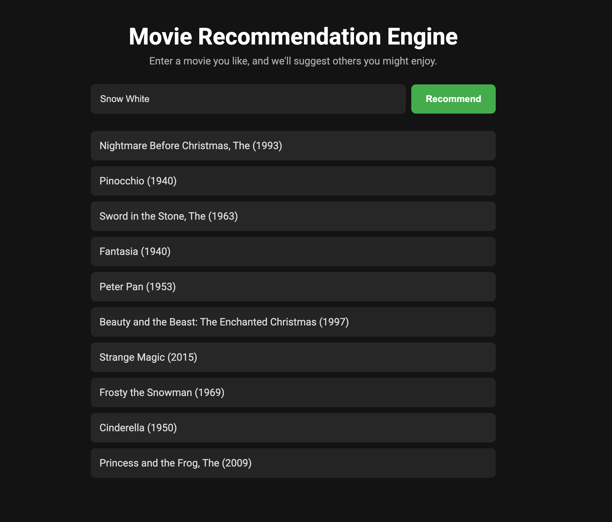

# 🎬 Movie Recommendation Engine

A full-stack web application that uses a content-based filtering algorithm to provide personalized movie recommendations. This project demonstrates an end-to-end machine learning workflow, from data processing and model creation to API development and building an interactive user interface.



> *Note: Replace this screenshot with one of your own by saving it as `screenshot.png` in your main project folder. Commit and push to GitHub, and it will appear above.*

---

## 📄 About The Project

This project was built to showcase the fundamental principles of machine learning and full-stack web development. The core of the application is a Python backend powered by Flask, which serves a recommendation model built with Pandas and Scikit-learn. The model suggests movies based on genre similarity using a TF-IDF vectorizer and cosine similarity calculations.

The backend exposes a simple REST API that can be consumed by any frontend. This project includes a lightweight, responsive frontend built with vanilla HTML, CSS, and JavaScript to provide an intuitive user experience.

---

## ✨ Key Features

* **Machine Learning Core:** Implements a content-based filtering model to recommend movies based on genre similarity.
* **REST API Backend:** A custom API built with Flask serves the model's predictions.
* **Data Processing:** Utilizes the Pandas library to load and prepare the MovieLens dataset.
* **Interactive Frontend:** A clean UI allows users to input a movie and receive a list of 10 recommendations fetched from the backend.

---

## 🛠️ Built With

### Backend & Machine Learning:

* Python
* Flask
* Pandas
* Scikit-learn
* Gunicorn

### Frontend:

* HTML5
* CSS3
* Vanilla JavaScript (ES6+)

---

## 🚀 Getting Started

To get a local copy up and running, follow these simple steps.

### Prerequisites

Make sure Python 3 and pip are installed on your system.

### Installation & Setup

1. **Clone the repository:**

```bash
git clone https://github.com/your_username/your_repository_name.git
```

2. **Navigate to the project directory:**

```bash
cd movie-recommender
```

3. **Create and activate a virtual environment:**

```bash
# Create the environment
python3 -m venv venv

# Activate on macOS/Linux
source venv/bin/activate

# Activate on Windows
venv\Scripts\activate
```

4. **Install required packages:**

```bash
pip install -r requirements.txt
```

5. **Download the dataset:**

* Get the [MovieLens dataset](https://grouplens.org/datasets/movielens/) (`ml-latest-small.zip`)
* Unzip it and place `movies.csv` and `ratings.csv` in the root of the project folder

---

## 🔄 Running the Application

Run the Flask development server:

```bash
flask run --port=8080
```

Visit [http://127.0.0.1:8080](http://127.0.0.1:8080) in your browser to use the app.

---

## 📊 API Endpoint

**GET** `/recommend`

**Query Parameter:** `title` (the name of the movie)

**Example:** `/recommend?title=The Dark Knight`

### Success Response:

```json
{
  "recommendations": ["Batman Begins", "Inception", ...]
}
```

### Error Response:

```json
{
  "error": "Movie not found."
}
```

---

## 🙏 Acknowledgments

This project uses the [MovieLens dataset](https://grouplens.org/datasets/movielens/), collected by the GroupLens research group at the University of Minnesota.

Big thanks to the developers and maintainers of the open-source libraries that made this project possible.
